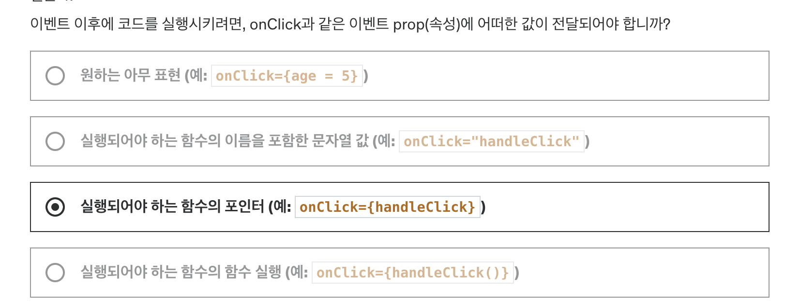

# 페이지 2

생성일: 2024년 1월 9일 오전 12:17

Component in React

: 리액트에서 컴포넌트는렌더링 가능한 내용을 반환하는 함수.

- 특히 JSX 코드.
  정의가 되고 나면, 커스텀 컴포넌트는 마치 다른 컴포넌트들의 JSX코드의

내장 HTML 요소처럼 사용될 수 있음.

(따라서 리액트로 작업할 때 JSX 코드를 반환하는 함수를 생성함으로써 새로운 컴포넌트를 정의한다.)

JSX의 목적

: 컴포넌트로부터 생성되어야하는 타겟 HTML 코드를 더 쉽게
정의할 수 있도록 하는 것

JSX는 타겟 UI/HTML 코드를 자바스크립트 코드안에 바로 정의할 수 있도록 함. 즉, 컴포넌트 바론 안에 정의.

JSX는 웹사이트 DOM을 업데이트할 명령어를 수행하는 컴포넌트 트리를 불러온다.

(JSX 코드는 마치 트리(나무) 모양의 코드 구조를 띄며 리액트에게 각 컴포넌트들이 어떻게 연관되어 있고 UI는 어떻게 보여야 하는지 알려줍니다. 그 다음, 올바른 명령어를 실행하여 실제 DOM을 제어함며 타겟 구조/코드를 반영합니다.

커스텀 컴포넌트는 JSX 코드 내 HTML 요소처럼 사용된다.


컴포넌트가 다른 컴포넌트나 내용을 감싸서 컴포넌트를 구축하는 것을 “컴포넌트 합성”이라고 함

```jsx
<menu>
  <TabButton>Components</TabButton>
</menu>
```

```jsx
export default function TabButton(props) {
  return (
    <li>
      <button>{props.children}</button>
    </li>
  );
}
```


뭘 쓰는 가는 취향 차이

children prop

: react에서 정해준 prop,, prop명 아무렇게나 못씀

항상 ⇒ children 이러면

<custom tag>{children}</custom tag> 이런 식으로 쓸 수 있음

⇒ “children”은 컴포넌트의 열림과 닫힘 태그 사이에 있는 어떠한 내용이든 전달 받습니다.

다른 prop들은 이름 자유롭게 설정 가능



By Default, React Components `Execute “Only Once!”`

→ You have to `“tell”` React If a Component `Should be Executed Again`.

### React Hooks

: React 프로젝트에서 ‘use’로 시작하는 모든 함수

- 컴포넌트 함수 안에서 바로 호출해야 함
- 다른 코드 안에 중첩되면 안됨
- 컴포넌트 함수의 최상위에서 선언되야 함


### 리액트 컴포넌트, JSX, 속성, 상태 .. Review

1. 리액트 앱에서 State(상태)의 존재 목적은?

   → 변화가 생겼을 때 리액트가 컴포넌트를 재평가하게 하는 데이터이다.
   (State가 속한 컴포넌트이며, 상태가 바뀌면 자녀와 자손 컴포넌트들이 재평가 됨)

2.


1.


## map 함수 이용한 데이터 목록 반환 방법(데이터를 jsx코드로)

```jsx
// map 함수는 현존하는 배열에 기반하여 새로운 배열을 제공
<ul>
  {CORE_CONCEPTS.map((conceptItem) => {
    <CoreConcept {...conceptItem} key={conceptItem.title} />;
  })}
</ul>
```

### 그냥 팁

```jsx
{
  !selectedTopic && <p>Please select a topic.</p>;
}
{
  selectedTopic ? (
    <div className="tab-content">
      <h3>{EXAMPLES[selectedTopic].title}</h3>
      <p>{EXAMPLES[selectedTopic].description}</p>
      <pre>
        <code>{EXAMPLES[selectedTopic].code}</code>
      </pre>
    </div>
  ) : null;
}
```


