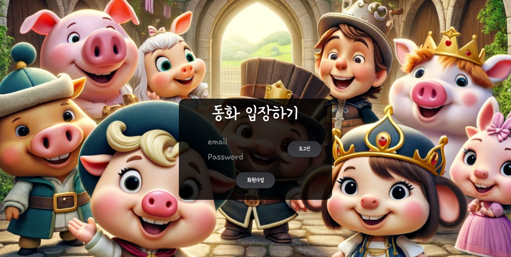
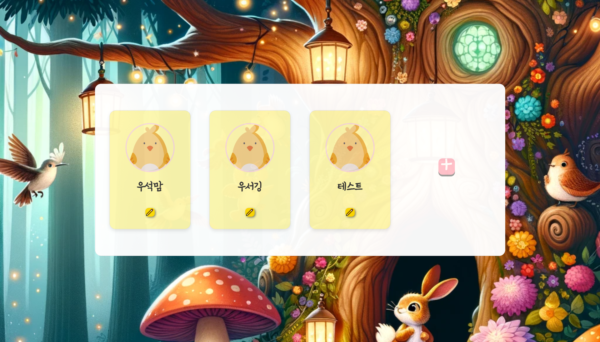
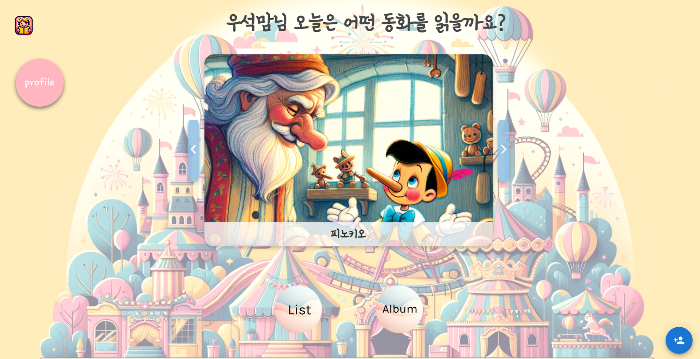
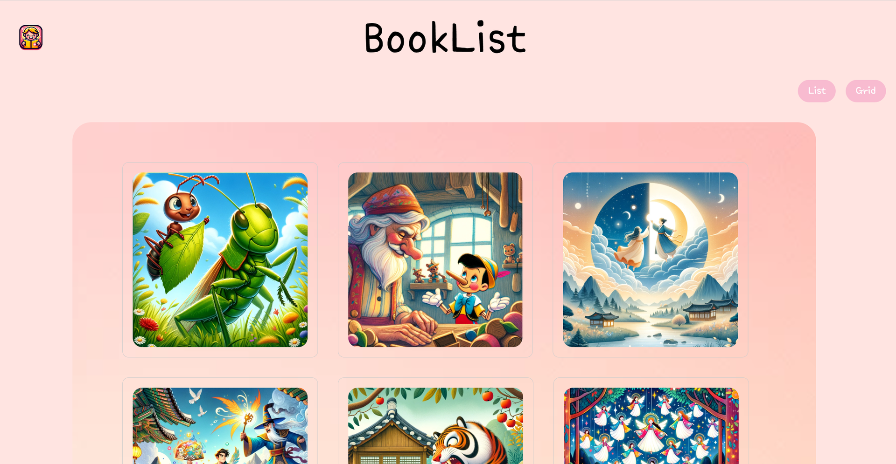
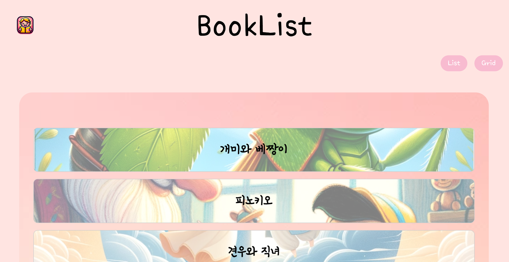
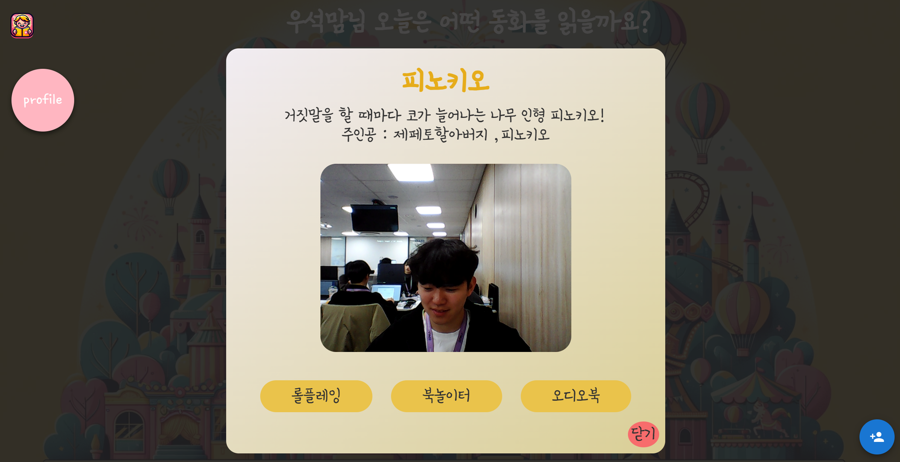
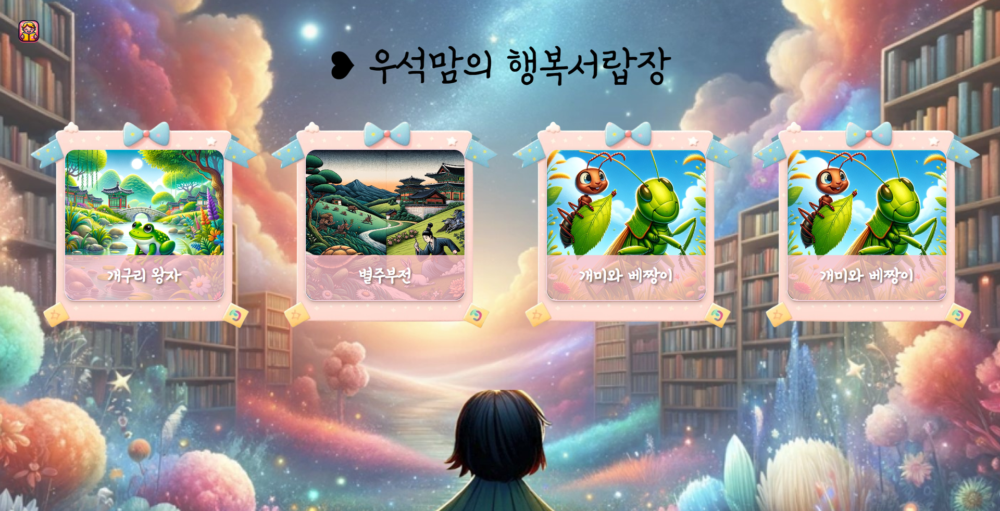
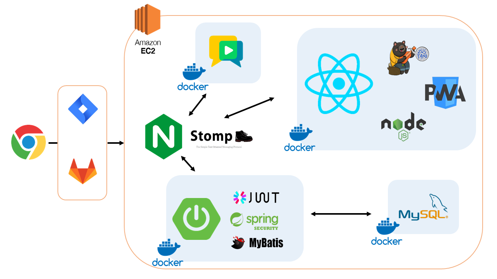
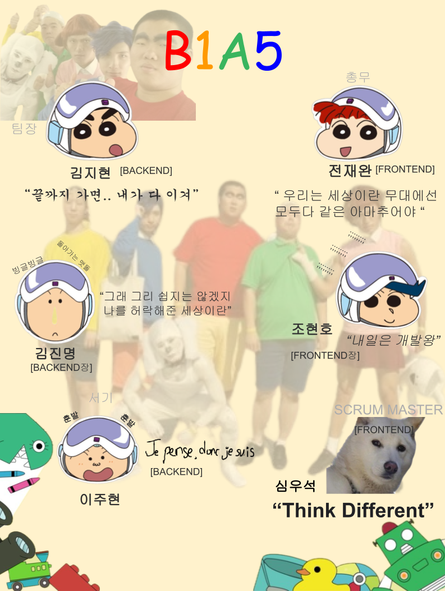
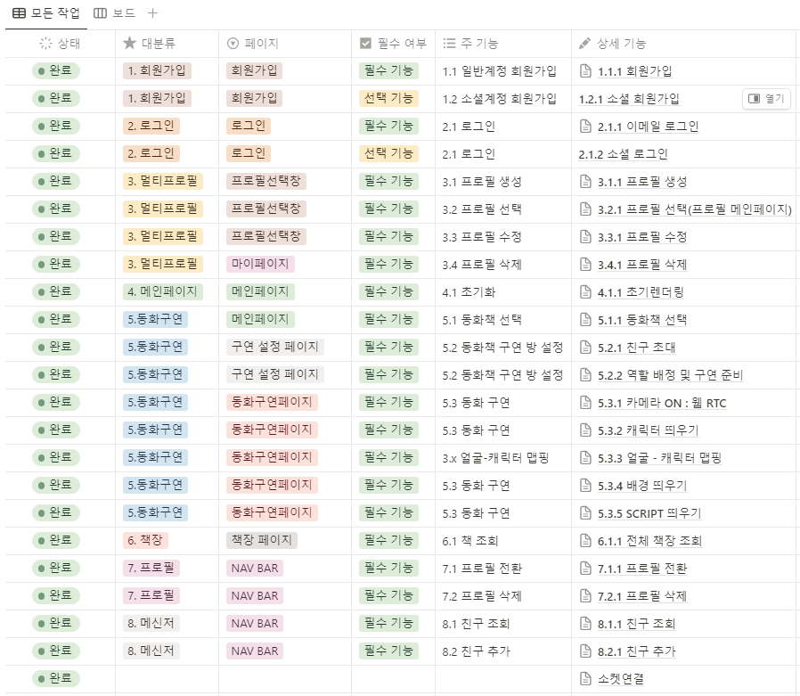

# Fodong

🔔 본 프로젝트는 삼성 청년 SW 아카데미 프로젝트 결과물입니다
<br/>
<br/>

## [🎥포동 UCC](https://youtu.be/rSUTV8cgYas)

## 🌳 프로젝트 일정

    📅 2024-01-03(수) ~ 2024-02-16(금) (6주)

## 📖 서비스 화면

#### 로그인 창 <br>



#### 프로필 선택 창 <br>



#### 메인 페이지 <br>



#### 책 리스트 <br>




#### 모달 창 <br>



#### 롤 플레잉 <br>


#### 북 놀이터 <br>


#### 행복 서랍 <br>


<br/>
<br/>

# 🌳 서비스 아키텍처 및 개발 환경

<br/>

## 💽 [BackEnd]

> - JAVA
> - Spring boot
> - Mybatis
> - Spring Security
> - JWT
> - MySQL
> - Nginx

## 🍭 [FrontEnd]

> - Java-script
> - React
> - node.js
> - zustand
> - styled-components
> - Material-UI
> - PWA

## 🖥 [webRTC]

> - openvidu

## 💾 [CI/CD]

> - aws ec2
> - docker

## 🎛 [ENV]

> - SockJs
> - STOMP<br/>

<br/>
<br/>

# 📖 Team Introduction


<br/><br/>

# 📖 주요 기능

### 1. face-api.js를 통한 롤플레잉

### 2. tts를 통한 오디오북

### 3. webRTC를 통한 북놀이터<br/>

<br/>
<br/>
<br/>

# 📖 기능 명세서

<br/>

# 📖 팀원 소개 및 역할

 <br/>

## **김지현**

> - 팀장
> - openCV를 이용한 face detection 구현
> - openCV 를 이용한 face-landmark detection 구현
> - openCV를 이용한 face-extraction 구현
> - openCV를 이용한 image-processing 구현
> - openCV -> face-api.js migration
> - Spring Boot를 사용해 백엔드 앨범 관리 API 구현 ( 녹화본 저장, 녹화본 조회)
> - 녹화본 DB 관리
> - nginx proxy pass 로컬-서버 연결
> - linux - window 간 파일 전송

<br/>
<br/>
<br/>

## **김진명** [BE / Deveops]

#### 환경설정

> - NGINX 서버 설정 및 관리
> - Docker 기반 프론트/백엔드 배포 및 관리
> - SockJS 연결 및 STOMP 프로토콜 설정 및 관리
> - JWT 기반 스프링 시큐리티 인증/인가 환경 구축
> - MySQL DB 구축 및 관리
> - Swagger 라이브러리 설정 및 관리
> - HTTP/WS CORS 설정 및 관리
> - 실시간 푸쉬 알람 및 데이터 공유 환경 구축

#### 기능

> - 계정 API 구현
> - 프로필 API 구현
> - 친구 기능 API 구현
> - 실시간 친구 요청/수락 API 구현
> - 실시간 게임 초대/수락 API 구현
> - 실시간 다중 참여 동화놀이 관련 API 구현
> - 동화책 API 구현
> - OPENVIDU API 구현

<br/>
<br/>


## **이주현** [TTS]

> - Ubuntu 환경 설정
> - Vits Training / Inference
> - training 데이터 : KSS dataset
> - pretrained model:
>   - ylacombe/mms-tts-kor-train
>   - Matthijs/mms-tts-kor
>   - sanchit-gandhi/mms-tts-kor
>   - ylacombe/mms-tts-kor-finetuned
>   - training tool : ESPnet, Hugging face
> - fine-tuning용 개인 음성 데이터 생성 및 전처리
> - Naver Clova Voice를 이용한 오디오북 음성 데이터 생성
> - Team's To do List Manager
> - 최종 PT

<br/>
<br/>
 <br/>

## **조현호** [Deveops / Fe]

[Deployment]

> - ec2 서버 환경 세팅
>   - 기초 설정 및 패키지 설치 및 관리
>   - SSL 인증 (letsencrypt, nginx-certbot)
>   - OpenVidu CE 플랫폼 설치
>     - 환경 변수 관리
>     - https 도메인 연결 설정

[FrontEnd]

> - Front-End 팀장
> - 중앙 상태 저장소 구현 및 관리 (zustand 활용)
> - Socket 연결 및 stomp 프로토콜 사용한 다 대 다 실시간 상호작용 기능 및 UI 구현 (Socket JS)
>   - 친구 추가
>   - 친구 초대
>   - 북놀이터(멀티플레이) 서비스
> - OpenVIdu 라이브러리를 활용한 화상 서비스 기능 및 UI 구현
>   - 북놀이터(멀티플레이) 서비스
> - 기타 REST API 활용한 백서버와 상호작용 로직 구현

<br/>
<br/>
 <br/>

## **심우석** [FrontEnd]

> - 스크럼 마스터 <br>
> - UI / UX 관리 <br>
> - PWA
>
> - Front 환경설정 및 라이브러리 설치 및 관리
> - Front 웹 컴포넌트 Grid 방식으로 구조화
> - 중앙 상태 저장소 구현 및 관리 (zustand 활용)
> - Turn.js 라이브러리를 활용한 동화책 넘기기 기능 tts기술을 해당 페이지에 맞춰 동화이미지, 스크립트, 음원 추출 기능 및 UI 구현
> - Media Query를 활용한 전체 component 반응형으로 구현
> - 기타 REST API를 활용한 백서버와의 상호작용 로직
>   - 회원가입, 로그인, 로그아웃 페이지 CRUD / 인증, 인가 및 UI
>   - 멀티프로필 CRUD 및 디자인
>   - 저장된 동화책을 활용한 LIST 메인페이지 / 동화책 전체페이지 데이터 출력 후 UI
>   - 실시간 다중 참여 동화놀이데이터를 활용한 스토리 대기방, 놀이방 구현 및 UI
>   - 녹화된 영상 앨범 페이지에 출력 후 UI
>   - 실시간 추가 된 친구 Modal 생성 및 UI

<br/>
<br/>

<br/>

## **전재완** [FE / AI]

> - Face-api
>   - Face-api(tiny-face-models, face_landmark_68_tiny_model) 활용하여 얼굴 맵핑
>   - canvas를 사용하여 Face-api를 통해 인식한 얼굴 결과를 시각화
> - 롤 플레이 기능 구현 및 녹화하기 기능 구현
>   - 캐릭터 선택 창
>   - 동화 구연 창
>   - 대사 별 캐릭터 이미지
>   - 페이지에 따른 캐릭터 위치 변경 및 얼굴 위치 일치
>   - 녹화 기능

<br/>
<br/>

# 📖 Commit Message Structure

```bash
**[타입]: 설명**
v
본문(선택 사항)
v
꼬리말(선택 사항)
```

### ① 제목

> [타입] : 설명

| 타입   | 설명             |
| ------ | ---------------- |
| `feat` | 새로운 기능 추가 |
| `fix`  | 수정             |
| `til`  | Today I Learn    |

### ② 본문

> WHAT이 아닌 WHY에 대한 내용

- 적을 필요가 없으면 안 적어도 됨

### ③ 꼬리말

> 연관되어 있는 JIRA 이슈 번호 등록

- 적을 필요가 없으면 안 적어도 됨

**예시**

```bash
git commit -m "[TIL]: 240117 GIT 활용 GUIDE"
```

```bash
git commit -m "[feat]: 권한 확인을 위한 가드 적용 로직 추가

              무엇을 추가했는지가 아니라, 왜 추가했는지 적기

              연관되어 있는 JIRA 이슈 번호"
```

```bash
git commit -m "[fix]: 푸시알림 허용 여부 변경 API 로직 수정

              무엇을 수정했는지가 아니라, 왜 수정했는지 적기

              연관되어 있는 JIRA 이슈 번호"
```

<br/>
<br/>

# 📖 BRANCH 전략

> GIT FLOW

## ① MERGE 시기

| branch :: FROM | branch :: TO | merge 시기                        |
| -------------- | ------------ | --------------------------------- |
| `feature`      | `develop`    | 해당 feature 구현이 완료됐을 경우 |
| `develop`      | `master`     | 모든 feature 구현이 완료됐을 경우 |

## ② 생명 주기

### `feature` 생명 주기

> feature/기능

1. `feature` 브랜치 생성
2. `feature` 브랜치에서 기능 개발
3. COMMIT & PUSH
4. REVIEW
   - 기능 구현이 완료될 때까지 `코드수정`/`commit`/`push` 반복
5. MERGE into `develop`
