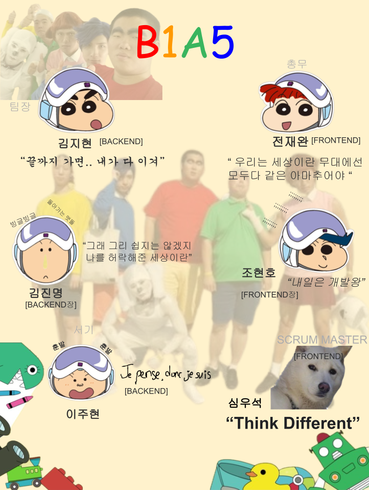

# README.md

# 1️⃣ Team Introduction



# 2️⃣ Commit Message Structure

```bash
**[타입]: 설명**
v
본문(선택 사항)
v
꼬리말(선택 사항)
```

### ① 제목
> [타입] : 설명


| 타입 | 설명 |
| --- | --- |
| `feat` | 새로운 기능 추가 |
| `fix` | 수정 |
| `til` | Today I Learn |

### ② 본문

> WHAT이 아닌 WHY에 대한 내용
> 
- 적을 필요가 없으면 안 적어도 됨

### ③ 꼬리말

> 연관되어 있는 JIRA 이슈 번호 등록
> 
- 적을 필요가 없으면 안 적어도 됨

**예시**

```bash
git commit -m "[TIL]: 240117 GIT 활용 GUIDE"
```

```bash
git commit -m "[feat]: 권한 확인을 위한 가드 적용 로직 추가

              무엇을 추가했는지가 아니라, 왜 추가했는지 적기
								
              연관되어 있는 JIRA 이슈 번호"
```

```bash
git commit -m "[fix]: 푸시알림 허용 여부 변경 API 로직 수정

              무엇을 수정했는지가 아니라, 왜 수정했는지 적기
              
              연관되어 있는 JIRA 이슈 번호"
```

# 3️⃣ BRANCH 전략

> GIT FLOW
> 

## ① MERGE 시기

| branch :: FROM | branch :: TO | merge 시기 |
| --- | --- | --- |
| `feature` | `develop` | 해당 feature 구현이 완료됐을 경우  |
| `develop` | `master` | 모든 feature 구현이 완료됐을 경우 |

## ② 생명 주기

### `feature` 생명 주기

> feature/기능
> 
1. `feature` 브랜치 생성
2. `feature` 브랜치에서 기능 개발
3. COMMIT & PUSH
4. REVIEW
    - 기능 구현이 완료될 때까지 `코드수정`/`commit`/`push` 반복
5. MERGE into `develop`
